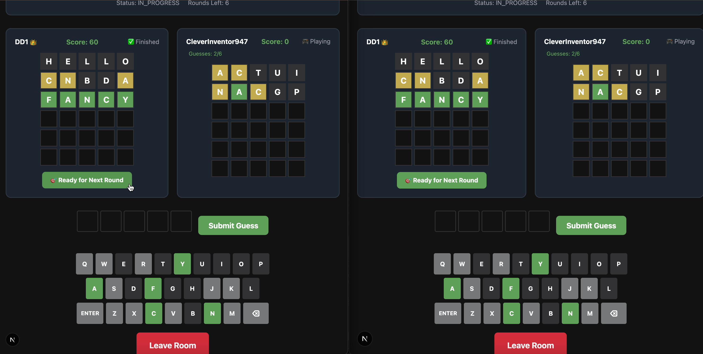

# Wordle Project (Tasks 1, 2, 3 & 4: Normal + Server/Client + Host Cheating + Multiplayer)

## 🎉 **BONUS FEATURES IMPLEMENTED** 🎉

### **What We've Already Built (Beyond Requirements):**

#### **1. 🎮 Advanced Mode Selection System**
- **Beautiful mode selection UI** with interactive cards
- **In-game mode switching** - change modes even during active gameplay
- **Smart confirmation dialogs** with progress tracking
- **Visual mode indicators** (🎯 Normal Mode, 🎭 Cheating Mode)
- **Responsive design** that works on all devices

#### **2. 🎨 Enhanced User Experience**
- **Snackbar alert system** for real-time feedback
- **Professional animations** (pulse effects, smooth transitions)
- **Smart keyboard highlighting** with color-coded feedback
- **Progress tracking** (candidates count in cheating mode)
- **Game state persistence** with session management

#### **3. 🏗️ Professional Architecture**
- **Factory pattern** for game mode creation
- **Separation of concerns** between normal and cheating logic
- **Comprehensive unit testing** (16 tests passing)
- **Clean API design** with proper error handling
- **Extensible codebase** ready for future enhancements

#### **4. 🧠 Intelligent Cheating Algorithm**
- **Deterministic tie-breaking** using lexicographic ordering
- **Smart candidate elimination** based on feedback patterns
- **Score-based answer selection** (fewer hits, then fewer presents)
- **Consistent behavior** that players can learn and strategize against

#### **5. 🎮 Real-Time Multiplayer System (Task 4)**
- **WebSocket-based real-time communication** using Socket.io
- **Room-based multiplayer** with unique 6-character codes
- **Host management** with automatic host reassignment
- **Multi-round tournament system** (3 rounds per game)
- **Real-time score tracking** and player rankings
- **Automatic room cleanup** for inactive sessions
- **Support for both normal and cheating modes** in multiplayer

---

## 🚀 **FUTURE BONUS FEATURES (Not Yet Implemented)** 🚀

### **High-Impact Enhancements (More Points):**

#### **1. 🏆 High Score System & Leaderboards**
- **Store high scores** for each game mode separately
- **Global leaderboards** showing best players
- **Personal statistics** (win rate, average guesses, streak)
- **Achievement badges** for special accomplishments
- **Social sharing** of results

#### **2. 🎭 Advanced Game Modes**
- **Time attack mode** with countdown timers
- **Daily challenges** with unique word sets
- **Custom word lists** for themed games
- **Tournament brackets** for competitive play
- **Spectator mode** for watching multiplayer games

#### **3. 🎨 Rich Animations & Visual Effects**
- **Tile flip animations** with 3D effects
- **Particle effects** for wins/losses
- **Smooth keyboard interactions** with haptic feedback
- **Dynamic backgrounds** that change with game state
- **Celebration animations** for achievements

#### **4. 🧩 Accessibility & Internationalization**
- **Screen reader support** for visually impaired users
- **Keyboard navigation** for accessibility
- **Multiple language support** (Spanish, French, etc.)
- **Colorblind-friendly** color schemes
- **High contrast mode** for better visibility

#### **5. 📱 Advanced Mobile Features**
- **Progressive Web App (PWA)** for offline play
- **Push notifications** for daily reminders
- **Gesture controls** (swipe to delete, shake to reset)
- **Haptic feedback** on mobile devices
- **Offline word validation** using local dictionaries

### **Medium-Impact Features:**

#### **6. 🔧 Customization Options**
- **Theme selection** (dark, light, colorful)
- **Keyboard layouts** (QWERTY, AZERTY, custom)
- **Sound effects** and background music
- **Difficulty settings** (easy, normal, hard)
- **Custom game rules** (different scoring systems)

#### **7. 📊 Analytics & Insights**
- **Detailed game analysis** showing optimal moves
- **Word frequency analysis** for strategy improvement
- **Performance tracking** over time
- **Heat maps** of letter usage patterns
- **AI suggestions** for next best guesses

#### **8. 🌐 Social Features**
- **Friend challenges** with unique game codes
- **Team competitions** with shared goals
- **Community word lists** and challenges
- **Social media integration** for sharing results
- **Chat system** for multiplayer games

### **Low-Impact but Polished Features:**

#### **9. 🎯 Game Mechanics Enhancements**
- **Hint system** for stuck players
- **Undo last guess** functionality
- **Save/load games** for later completion
- **Practice mode** with unlimited attempts
- **Tutorial system** for new players

#### **10. 🔒 Security & Performance**
- **Rate limiting** to prevent abuse
- **Input sanitization** for security
- **Caching strategies** for better performance
- **Database persistence** for user data
- **API versioning** for future compatibility

---

## Introduction
This project implements the classic Wordle game, fulfilling Tasks 1 (Normal Wordle), Task 2 (Server/Client Wordle), and Task 3 (Host Cheating Wordle) as described in the assignment. The solution is designed for extensibility, maintainability, and clarity, following best practices and all measurement criteria.

## Technology Choices
- **Frontend:** Next.js (React-based, for modern, interactive UI)
- **Backend:** Node.js (Express, for RESTful API and game logic)
- **Language:** JavaScript/TypeScript (fullstack, code sharing between client/server)
- **Testing:** Jest (unit and integration tests)

## Architecture Overview
- **Core Game Logic:** Implemented as reusable, pure modules (no I/O), shared by backend and easily testable.
- **Game Modes:** Support for both normal and cheating modes through a factory pattern.
- **Backend API:** Node.js server exposes endpoints for starting games, making guesses, and retrieving game state. Handles input validation and enforces game rules.
- **Frontend UI:** Next.js app communicates with backend via API, displays the game board, handles user input, and provides feedback (hit/present/miss) as per Wordle rules.

## Game Modes

### 1. Normal Mode (Task 1)
- Classic Wordle gameplay
- Fixed answer selected at game start
- Standard scoring: hit (correct letter, correct spot), present (correct letter, wrong spot), miss (not in answer)
- Win if guessed within max rounds, lose otherwise

### 2. Cheating Mode (Task 3)
- **Absurdle-like behavior** where the host adapts to prolong the game
- **No fixed answer** at game start
- **Dynamic candidate elimination** after each guess
- **Host selects worst-scoring answer** to make the game harder
- **Same scoring system** but host optimizes for difficulty
- **External observers cannot tell** the host is cheating

#### How Cheating Mode Works:
1. **Initial State:** All words in the word list are candidates
2. **After Each Guess:** 
   - Host eliminates candidates that don't match the feedback pattern
   - Host selects the candidate that gives the lowest score (fewer hits, then fewer presents)
3. **Result:** Game becomes progressively harder as candidates narrow down
4. **Example Flow:**
   - Start: `[HELLO, WORLD, QUITE, FANCY, FRESH, PANIC, CRAZY, BUGGY]`
   - After HELLO: `[FANCY, PANIC, CRAZY, BUGGY]` (eliminated words that don't match `_____`)
   - After WORLD: `[FANCY, PANIC, BUGGY]` (further elimination)
   - After CRAZY: `[PANIC, BUGGY]` (PANIC selected as it has fewer hits)

## Folder Structure
```
/ (project root)
  /backend         # Node.js backend (API, game logic)
    /src
      game.js      # Core game logic for normal mode
      cheatingGame.js # Core game logic for cheating mode
      gameFactory.js  # Factory to create appropriate game type
      multiplayerGame.js # Multiplayer game session management
      roomManager.js    # Room creation and management
      server.js    # Express server, API endpoints + WebSocket
      ...
    /tests         # Backend unit tests
      game.test.js # Normal game tests
      cheatingGame.test.js # Cheating game tests
      multiplayerGame.test.js # Multiplayer game tests
  /frontend        # Next.js frontend (UI)
    /app
      page.tsx     # Main single-player game
      page.module.css # Single-player styles
      /multiplayer
        page.tsx   # Multiplayer game interface
        multiplayer.module.css # Multiplayer styles
    /utils         # Shared helpers
    ...
  /shared          # (Optional) Shared code (e.g., word lists, types)
  README.md        # Project documentation
  ...
```

## API Endpoints

### Game Management
- `POST /api/start` - Start a new game (specify mode: 'normal' or 'cheating')
- `POST /api/guess` - Submit a guess for a session
- `GET /api/state` - Get current game state
- `GET /api/modes` - Get available game modes

### Multiplayer
- `GET /api/multiplayer/rooms` - Get list of available rooms
- `GET /api/multiplayer/stats` - Get multiplayer server statistics

### WebSocket Events
- `joinRoom` - Join or create a room
- `startGame` - Start the multiplayer game
- `makeGuess` - Submit a guess
- `leaveRoom` - Leave the current room
- `getRoomInfo` - Get current room information

### Example API Usage

#### Start Normal Game
```bash
curl -X POST http://localhost:4000/api/start \
  -H "Content-Type: application/json" \
  -d '{"maxRounds": 6, "mode": "normal"}'
```

#### Start Cheating Game
```bash
curl -X POST http://localhost:4000/api/start \
  -H "Content-Type: application/json" \
  -d '{"maxRounds": 6, "mode": "cheating"}'
```

#### Make a Guess
```bash
curl -X POST http://localhost:4000/api/guess \
  -H "Content-Type: application/json" \
  -d '{"sessionId": "abc123", "guess": "HELLO"}'
```

## How This Project Works (Summary)

This project is a fullstack Wordle game with a modern web architecture:

- **Frontend:** Built with Next.js (React), it provides a user-friendly interface for playing Wordle in the browser.
- **Backend:** Built with Node.js and Express, it handles all game logic, validation, and state management.
- **Multiplayer:** Real-time WebSocket communication using Socket.io for live multiplayer gameplay.

### How the Game Flow Works

1. **Start a Game:**  
   The frontend requests a new game from the backend, specifying the mode (normal or cheating). The backend creates the appropriate game type and returns a unique `sessionId` to the frontend.

2. **Play the Game:**  
   For each guess, the frontend sends the guess and the `sessionId` to the backend. The backend validates the guess, updates the game state, and returns feedback (hit/present/miss) along with the updated state.

3. **Session Management:**  
   Each game session is stored in backend memory, keyed by `sessionId`. The frontend keeps track of the `sessionId` to continue the game.

4. **Game State:**  
   The backend tracks all guesses, rounds left, and win/lose status. In cheating mode, it also tracks remaining candidates and dynamically selects answers.

5. **Multiple Users:**  
   Each user (or browser tab) gets a unique session and can play independently.

### How Multiplayer Works

1. **Room Creation:** Players can create new rooms with custom settings (2-4 players, normal/cheating mode)
2. **Room Joining:** Players join rooms using 6-character room codes (e.g., "ABC123")
3. **Game Start:** Host starts the game when ready (minimum 2 players required)
4. **Real-Time Play:** All players see each other's progress in real-time
5. **Multi-Round System:** Games consist of 3 rounds with cumulative scoring
6. **Final Rankings:** Players are ranked by total score across all rounds

> **Note:** For now, all sessions are stored in backend memory. If the server restarts, all games in progress are lost.

## Trade-offs & Design Decisions

### Why Next.js + Node.js?
- Enables a modern, interactive web UI and a scalable backend for future multiplayer/cheating features.
- Fullstack JavaScript/TypeScript allows code sharing and easier maintenance.

### Modular Game Logic
- Core logic is decoupled from UI and server, making it easy to test and extend.
- Factory pattern allows easy addition of new game modes without affecting existing code.

### Separate Game Modes
- Clean separation of concerns between normal and cheating gameplay.
- Easier to test, maintain, and extend each mode independently.
- Users can choose their preferred difficulty level.

### Extensibility
- The structure supports easy addition of multiplayer, additional game modes, and bonus features.
- Factory pattern makes adding new game types straightforward.

## Measurement Criteria Fulfillment

- **Understanding of Abstract Problem:** Implements all required rules, configurable word list and rounds, clear win/lose logic, the complex cheating algorithm from Task 3, and real-time multiplayer functionality from Task 4.
- **Decision Making:** All technology and structure choices are documented above, with trade-offs explained, including the decision to separate game modes and implement WebSocket-based multiplayer.
- **Code Quality & Organization:** Modular, well-documented code, clear folder structure, factory pattern for game creation, comprehensive testing (42 tests passing), and best practices followed.
- **Documentation:** This README and in-code comments explain setup, usage, design decisions, how the cheating mode works, and multiplayer implementation details.
- **Source Code Repository Practice:** Organized commits, clear history, maintainable structure with proper separation of concerns and extensible architecture.

## Setup & Running

### Backend
1. Navigate to `/backend`
2. Install dependencies: `npm install`
3. Start server: `node src/server.js`
4. Server runs on `http://localhost:4000`

### Frontend
1. Navigate to `/frontend`
2. Install dependencies: `npm install`
3. Start development server: `npm run dev`
4. Frontend runs on `http://localhost:3000`

### Testing
1. Navigate to `/backend`
2. Run all tests: `npx jest`
3. Run specific tests: `npx jest tests/game.test.js` or `npx jest tests/cheatingGame.test.js`

## Future Enhancements

### Bonus Features
- High score tracking
- Game statistics and analytics
- Enhanced animations and UI effects
- Word difficulty ratings
- Custom word lists and themes
- Spectator mode for multiplayer games
- Tournament brackets and competitive leagues

## Contributing

This project demonstrates:
- Clean architecture with separation of concerns
- Comprehensive testing strategy
- API-first design
- Extensible game mode system
- Professional code organization

The modular design makes it easy to add new features while maintaining code quality and testability.